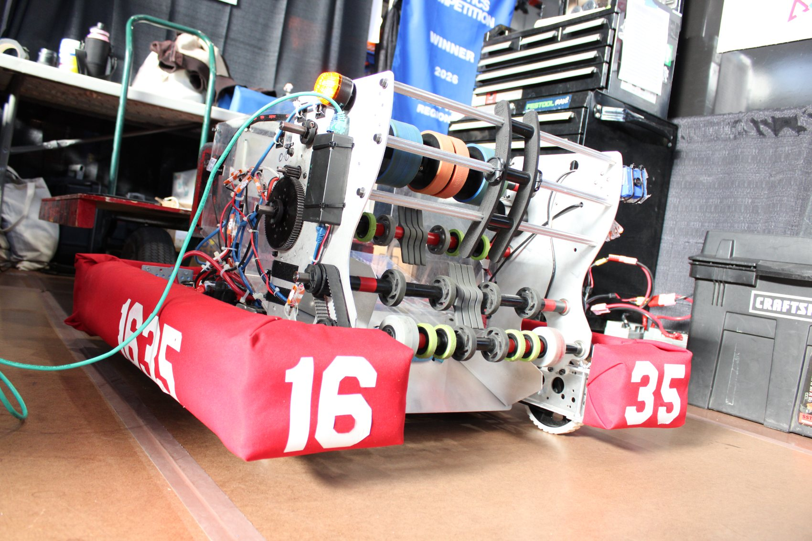
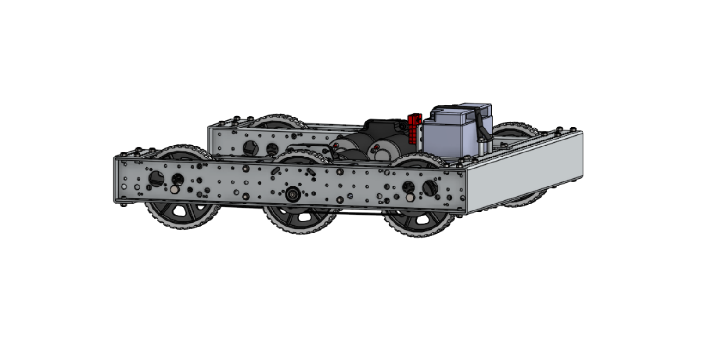

# ⚡ NEWTOWN&nbsp;TECHNOTICS ⚡

## `FRC` · TEAM&nbsp;**`1635`**

**Build robots. Build engineers.**
*A robotics team that happens to be a public high school.* 🔴⚙️

 

 

### 🏆 &nbsp; `2005` rookie &nbsp;·&nbsp; `21` years &nbsp;·&nbsp; `~50` students &nbsp;·&nbsp; `6 wk` to a robot &nbsp; 🏆

`━━━━━━━━━━━━━━━━━━━━━━━━━━━━━━━━━━━━━━━━━━━━━━━━━━━━━━━━━━━━━━━━`

## 🤖 &nbsp; THE 2026 ROBOT **REBUILT**

Custom drivetrain. Compliant-roller intake tower. Sheet-aluminum frame, CNC'd and 3D-printed in the shop, wrapped in red bumpers reading **`16`** and **`35`**. From CAD to the competition floor in **45 days**.

<table>
<tr>
<td width="60%"></td>
<td width="40%"> 
<b>DRIVETRAIN</b> · Fusion / Inventor
</td>
</tr>
</table>

`━━━━━━━━━━━━━━━━━━━━━━━━━━━━━━━━━━━━━━━━━━━━━━━━━━━━━━━━━━━━━━━━`

## 🔥 &nbsp; WHO WE ARE

Newtown High School sits in **Elmhurst, Queens** a neighborhood where the students speak dozens of languages. Every winter a chunk of them spend their nights over a CAD model, a soldering iron, and a half-built drivetrain. Since **2005** we've competed every season, most recently at the **NYC Regional** inside the Armory where you'll find us in the stands holding three-foot-tall red **16** and **35** and never quite sitting down.

### ⚙️ Mechanical &nbsp;·&nbsp; ⚡ Electrical &nbsp;·&nbsp; 💻 Programming &nbsp;·&nbsp; 📐 CAD &nbsp;·&nbsp; 📣 Outreach

`Java` · `WPILib` · `Fusion` · `Inventor` · `CNC` · `Mill` · `Lathe` · `3D Print` · `CAN bus`

`━━━━━━━━━━━━━━━━━━━━━━━━━━━━━━━━━━━━━━━━━━━━━━━━━━━━━━━━━━━━━━━━`

## 🤝 &nbsp; WE DON'T EXIST WITHOUT THESE PEOPLE

<table>
<tr>
<td align="center" width="33%"> <b>Arsenal · NY</b> Title sponsor</td>
<td align="center" width="33%"> <b>Newtown HS</b> Shop, faculty, students</td>
<td align="center" width="33%"> <b>NYC FIRST</b> The Regional</td>
</tr>
</table>

`━━━━━━━━━━━━━━━━━━━━━━━━━━━━━━━━━━━━━━━━━━━━━━━━━━━━━━━━━━━━━━━━`

## 🚀 &nbsp; JOIN US

### **You don't need to know anything. You need to show up.**

We'll teach you to mill, to solder, to write code and to lose a match gracefully and fix the robot for the next one.

 

